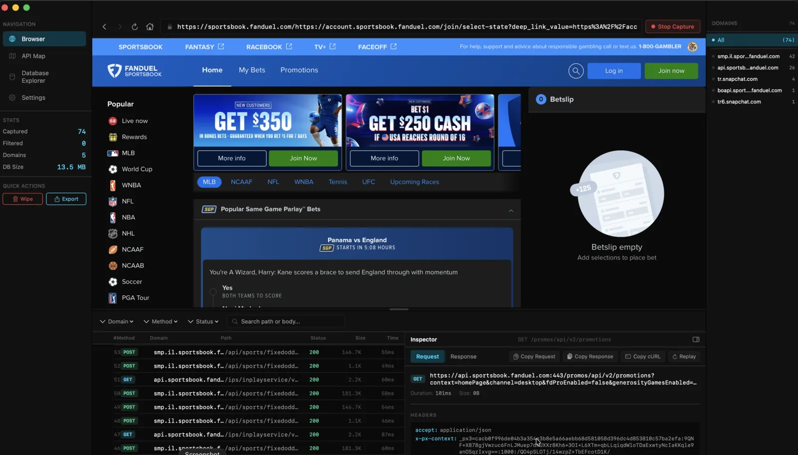
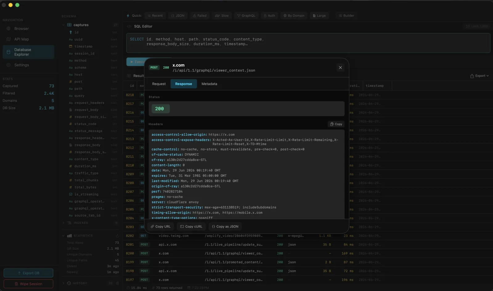
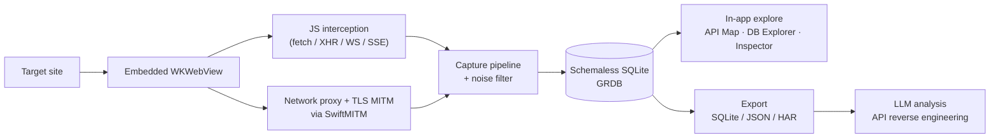

<div align="center">


# APIGhost

**Passive API traffic capture & interception for macOS.**
Browse a target in an embedded browser, capture its API traffic, and explore it in-app. Export a clean SQLite, then hand it to an LLM for further exploration.


</div>

---

## What it is

APIGhost is a **focused, passive** API reconnaissance tool. You browse a site in an integrated WebView; APIGhost records the API traffic that browser generates, stores it in SQLite, and lets you explore and export it.

- **Passive only.** It captures and analyzes. It never probes, fuzzes, or attacks.
- **No AI in the app.** APIGhost captures and exports. The analysis happens outside, in an LLM you trust.
- **The export is the product.** A clean, complete SQLite is the deliverable. Everything else serves producing one.
- **Isolated and session-based.** Only the embedded browser's traffic is captured, one ephemeral session at a time.

<div align="center">


</div>

## Install

Download the latest DMG and drag APIGhost into Applications:

```bash
curl -L -o APIGhost.dmg \
  https://github.com/ul0gic/api-ghost/releases/latest/download/APIGhost.dmg
open APIGhost.dmg
```

Or grab it from the [Releases page](https://github.com/ul0gic/api-ghost/releases/latest). The app is signed with a Developer ID and notarized by Apple, so it opens without Gatekeeper warnings. Requires **macOS 26.1+**.

Optionally confirm the DMG was built by this repo's release pipeline:

```bash
gh attestation verify APIGhost.dmg --repo ul0gic/api-ghost
```

## Features

- **Embedded browser capture.** Full WKWebView navigation. Log in once, and auth persists across wipes.
- **Real-time interception.** Fetch, XHR, WebSocket, and SSE captured as you browse.
- **Network proxy mode.** An optional TLS MITM proxy captures what page JS can't see: service-worker traffic, browser-managed headers, and raw bytes on the wire.
- **API Map.** A tree view with path-pattern detection that normalizes UUIDs, IDs, and hashes.
- **Database Explorer.** A SQL editor over the live capture database, with quick-query chips.
- **Request and response inspector.** Headers, bodies, and timing. Copy as cURL or JSON.
- **Transparent noise filtering.** A categorized blocklist for analytics, ads, telemetry, and CDNs, all visible and toggleable.
- **GraphQL-aware.** Operation name and type are surfaced instead of collapsing every call into one `POST /graphql`.
- **Export.** One click to SQLite, JSON, or HAR.

## How it works



**Schemaless SQLite.** Captures are stored raw. Request, response, headers, bodies, timing, and metadata all live in one flat, queryable table. There's no rigid ORM shape to fight, and the single `.sqlite` file is the export, so handing it to an LLM (or `sqlite3`) needs zero conversion.

**Dual interception.** JS interception needs zero setup and no certificate. Network-proxy mode adds TLS MITM — a local `SwiftMITM` engine over SwiftNIO, routed through `WKWebsiteDataStore.proxyConfigurations` — and captures what page-context JS can't see: service-worker traffic, browser-managed headers, and raw bytes on the wire.

## Why: security use cases

APIGhost shines anywhere you need to know *exactly* what an app talks to. The export feeds an LLM that turns hundreds of captured calls into a documented API surface.

**Offensive / research**
- Reverse-engineer undocumented internal and partner APIs.
- Map an app's full backend surface, auth flows, and token handling.
- Surface hidden, debug, or deprecated endpoints still reachable from the client.
- Spot secrets, keys, and PII leaking through client-visible responses.

**Defensive / blue-team**
- Audit your own product's traffic for over-sharing and accidental data exposure.
- Inventory third-party / tracker calls a page actually makes.
- Generate ground-truth API documentation from real client behavior.
- Validate that sensitive fields never cross the wire to the browser.

## Contributing

Building from source requires **macOS 26.1+** and **Xcode 26.2+**:

```bash
git clone https://github.com/ul0gic/api-ghost.git
cd api-ghost
open api-ghost.xcodeproj   # build & run the `api-ghost` scheme
```

Dependencies resolve automatically via Swift Package Manager.

## License

[MIT](LICENSE). Do whatever you want with it.

> **Disclaimer.** APIGhost is a capture tool; it can surface sensitive data. You are responsible for how you use it and for having authorization to capture the traffic you point it at. ul0gic is not responsible for what anyone does with this tool.
