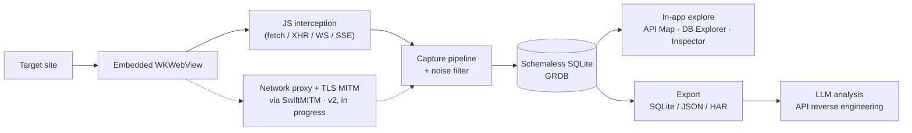

<div align="center">


# APIGhost

**Passive API traffic capture & interception for macOS.**
Browse a target in an embedded browser, capture its API traffic, explore it in-app, export a clean SQLite — then hand that to an LLM to reverse-engineer the API.


</div>

---

## What it is

APIGhost is a **focused, passive** API reconnaissance tool. You browse a site in an integrated WebView; APIGhost records the API traffic that browser generates, stores it in SQLite, and lets you explore and export it.

- **Passive only** — capture and analyze, never probe, fuzz, or attack.
- **No AI in the app** — APIGhost captures and exports; the analysis happens *outside*, in an LLM you trust.
- **The export is the product** — a clean, complete SQLite is the deliverable. Everything else serves producing one.
- **Isolated & session-based** — only the embedded browser's traffic is captured, one ephemeral session at a time.

<div align="center">


</div>

## Features

- **Embedded browser capture** — full WKWebView navigation; log in once, auth persists across wipes.
- **Real-time interception** — fetch / XHR / WebSocket / SSE captured as you browse.
- **API Map** — tree view with path-pattern detection (UUID / ID / hash normalization).
- **Database Explorer** — SQL editor over the live capture DB with quick-query chips.
- **Request/response inspector** — headers, bodies, timing; copy as cURL / JSON.
- **Transparent noise filtering** — categorized blocklist (analytics, ads, telemetry, CDNs), all visible and toggleable.
- **GraphQL-aware** — operation name + type surfaced instead of collapsing every call into one `POST /graphql`.
- **Export** — one click to **SQLite / JSON / HAR**.

## How it works



**Schemaless SQLite.** Captures are stored raw — request/response, headers, bodies, timing, and metadata in one flat, queryable table. No rigid ORM shape to fight; the single `.sqlite` file *is* the export, so handing it to an LLM (or `sqlite3`) needs zero conversion.

**Dual interception (planned).** v1 ships **JS interception** — zero setup, no certificate. v2 adds a **network proxy with TLS MITM** (a local `SwiftMITM` engine over SwiftNIO, routed through `WKWebsiteDataStore.proxyConfigurations`) to capture what page-context JS can't see: service-worker traffic, browser-managed headers, and raw bytes on the wire.

## Why — security use cases

APIGhost shines anywhere you need to know *exactly* what an app talks to. The export feeds an LLM that turns hundreds of captured calls into a documented API surface.

**Offensive / research**
- Reverse-engineer undocumented internal and partner APIs.
- Map an app's full backend surface, auth flows, and token handling.
- Surface hidden, debug, or deprecated endpoints still reachable from the client.
- Spot secrets, keys, and PII leaking through client-visible responses.

**Defensive / blue-team**
- Audit your own product's traffic for over-sharing and accidental data exposure.
- Inventory third-party / tracker calls a page actually makes.
- Generate ground-truth API documentation from real client behavior.
- Validate that sensitive fields never cross the wire to the browser.

## Build from source

Requires **macOS 26.1+** and **Xcode 26.2+**.

```bash
git clone https://github.com/ul0gic/api-ghost.git
cd api-ghost
open api-ghost.xcodeproj   # build & run the `api-ghost` scheme

# headless build (skips signing)
xcodebuild build -project api-ghost.xcodeproj -scheme api-ghost \
  -destination 'platform=macOS' -configuration Release CODE_SIGNING_ALLOWED=NO
```

Dependencies resolve automatically via Swift Package Manager (GRDB; the SwiftNIO stack for v2 network mode).

## License

[MIT](LICENSE) — do whatever you want with it.

> **Disclaimer.** APIGhost is a capture tool; it can surface sensitive data. You are responsible for how you use it and for having authorization to capture the traffic you point it at. ul0gic is not responsible for what anyone does with this tool.
